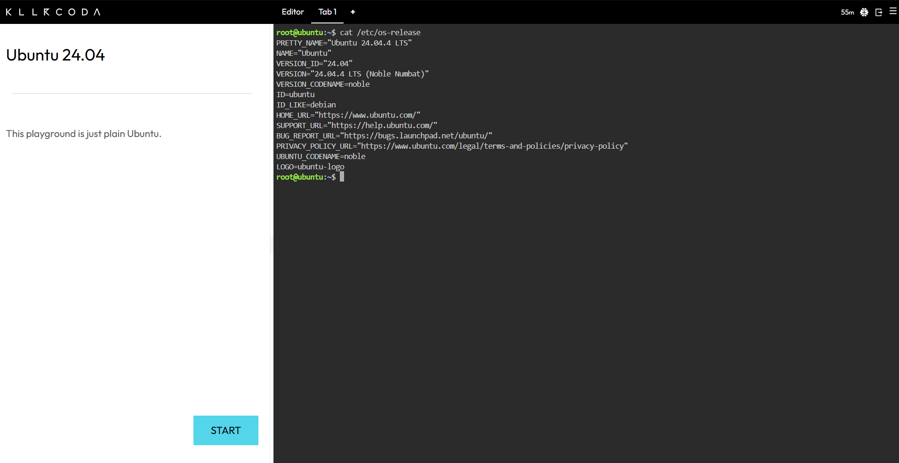
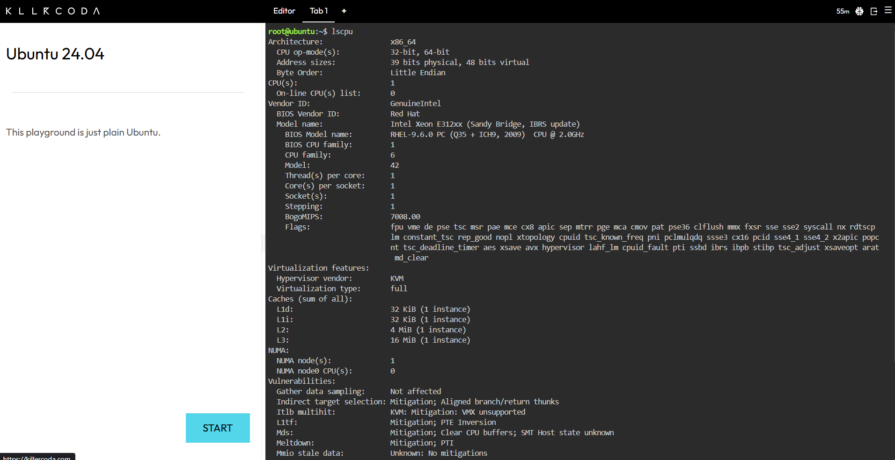
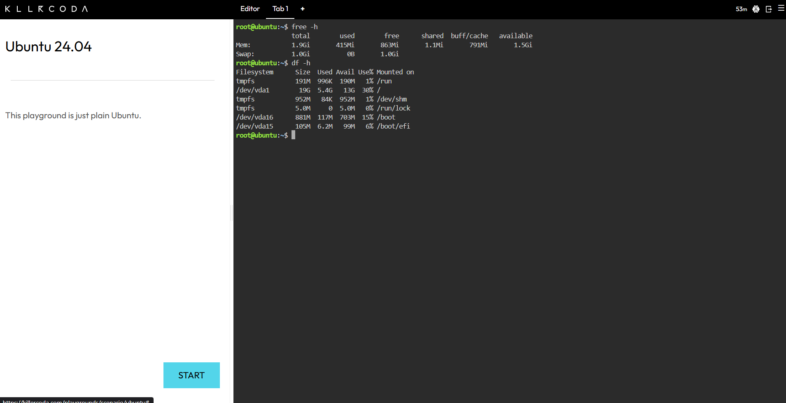

# Laboratory 03 – Multi-Cloud Explorer

## Checkpoint 7 – Linux Investigation

### System Information

The Linux server was investigated using the following commands in KillerCoda:

- `cat /etc/os-release` – identifies the operating system.
- `lscpu` – displays CPU information.
- `free -h` – displays memory information.
- `df -h` – displays disk space information.

### Results

| Information | Result |
|---|---|
| Operating System | Ubuntu 24.04.4 LTS (Noble Numbat) |
| CPU | Intel Xeon E312xx (Sandy Bridge, IBRS update) |
| Architecture | x86_64 |
| CPU(s) | 1 |
| CPU Frequency | 2.0 GHz |
| Memory | 1.9 GiB total |
| Disk Space | 19 GB total, 5.4 GB used, 13 GB available |

### Cloud Hosting Options

If this Linux server were migrated to the cloud, the following services could be used to host it:

| Cloud Provider | Service | Description |
|---|---|---|
| AWS | Amazon EC2 | A cloud-based virtual server service that can run Linux workloads. |
| Microsoft Azure | Azure Virtual Machines | A cloud-based virtual machine service that can run Linux workloads. |
| GCP | Compute Engine | A virtual machine service that can run Linux workloads. |

### KillerCoda Evidence

> **Note:** The KillerCoda terminal output was divided into three screenshots because the complete output could not fit clearly in one screenshot. The three screenshots together provide the required evidence for the Operating System, CPU, Memory, and Disk Space information.

The following screenshots show the Linux system information collected from the KillerCoda terminal:

